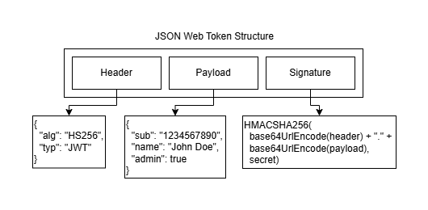

# DIO - Trilha Spring Framework

<div style="display:inline-block">
        <picture>
                <source media="(prefers-color-scheme: light)" srcset="https://img.shields.io/badge/Java-black?style=for-the-badge&logo=OpenJDK&logoColor=white">
                
        </picture>
        <picture>
                <source media="(prefers-color-scheme: light)" srcset="https://img.shields.io/badge/Maven-black?style=for-the-badge&logo=ApacheMaven&logoColor=white">
                
        </picture>
        <picture>
                <source media="(prefers-color-scheme: light)" srcset="https://img.shields.io/badge/Spring_Boot-black?style=for-the-badge&logo=SpringBoot&logoColor=white">
                
        </picture>
	<picture>
                <source media="(prefers-color-scheme: light)" srcset="https://img.shields.io/badge/Spring Security-black?style=for-the-badge&logo=SpringSecurity&logoColor=white">
                
        </picture>
	<picture>
                <source media="(prefers-color-scheme: light)" srcset="https://img.shields.io/badge/JWT-black?style=for-the-badge&logo=JsonWebTokens&logoColor=white">
                
        </picture>
</div>

## Autor dos Exercícios e Repositório Original

* [Gleyson Sampaio](https://github.com/glysns)
* [Spring Security e JWT](https://github.com/digitalinnovationone/dio-springboot/tree/main/dio-spring-security-jwt)

## Exercício

Este repositório contém um exercício que coloca em prática os seguintes temas:

* Spring Security
* Spring Data Jpa
* JWT

## Spring Security

`Spring Security` é um framework altamente customizável que provê `autenticação e autorização`, sendo o framework de segurança padrão para aplicações baseadas em Spring.

## Configurar Spring Security

Para utilizar o Spring Security em uma aplicação Spring Web, basta adicionar o starter a seguir ao projeto.

### Maven

```xml
<dependency>
    <groupId>org.springframework.boot</groupId>
    <artifactId>spring-boot-starter-security</artifactId>
    <version>3.3.1</version>
</dependency>

```

### Gradle

```groovy
implementation group: 'org.springframework.boot', name: 'spring-boot-starter-security', version: '3.3.1'

```

## Terminologia

Alguns dos termos que devem ser compreendidos no contexto do Spring Security são:

* `Autenticação`: é a forma pela qual a identidade de alguém que deseja acessar algum recurso é verificada;
* `Autorização`: é determinar quais usuários tem acesso permitido a um determinado recurso;
* `Principal`: é o objeto que identifica o usuário no contexto da autenticação. É frequentemente uma instância de UserDetails, uma interface cujas implementações armazenam informações de usuários e são gerenciadas por um UserDetailsService;
* `GrantedAuthority`: é cada uma das permissões dadas a um usuário, muitas vezes representadas por papéis (roles) como ROLE_ADMIN ou ROLE_USER, para definir que um usuário é um administrador ou um usuário simples, respectivamente.

## Autenticação Simples

A `autenticação simples` é feita por meio de usuário e senha. O Spring Security oferece alguns mecanismos para a leitura dessas credenciais, sendo o padrão, o mecanismo de `formulário`. O formulário solicita as credenciais e pode ser acessado em localhost:8080/login após a adição do starter do Spring Security e com a aplicação em execução.

As credenciais padrões são user e a senha aleatória que é gerada e exibida no terminal a cada inicialização da aplicação dessa forma:

```
Using generated security password: 25b3e4bb-cdbb-415d-8f17-0d059bbe5cc2
```

### Application Properties

As credenciais podem ser alteradas por meio do arquivo `application.properties`, como demonstrado abaixo.

```properties
spring.security.user.name=admin
spring.security.user.password=1234
```

### Memória

Também é possível armazenar credenciais na `memória`, criando instâncias de UserDetails manualmente. Essa alternativa permite a criação de vários perfis de acesso. A seguir, é possível observar a criação de dois perfis de acesso.

```java
@Configuration
@EnableWebSecurity
public class SecurityConfiguration {

        @Bean
        public UserDetailsService userDetailsService() {
                // Perfil de acesso user
                UserDetails user = User.withUsername("user").password("{noop}user1234").roles("USER").build();

                // Perfil de acesso admin
                UserDetails admin = User.withUsername("admin").password("{noop}admin1234").roles("USER", "ADMIN").build();

                return new InMemoryUserDetailsManager(user, admin);
        }

}
```

### Banco de Dados

A melhor alternativa para o armazenamento de credenciais é evidentemente o armazenamento em `banco de dados`. Para isso, é preciso configurar um banco de dados e utilizar o Spring Data Jpa para a criação de um repositório para armazenar os usuários que siga a seguinte estrutura:

```java
public interface UserRepository extends JpaRepository<User, Long> {

        // Método que busca usuário pelo nome de usuário
        public User findByUsername(String username);

}
```

Também é preciso definir como a criação de instâncias de UserDetails são criadas (aqui elas serão criadas automaticamente, ao contrário do armazenamento em memória), por meio da definição do método `loadUserByUsername`. Observe o exemplo a seguir que demonstra a busca do usuário no repositório, a definição de suas autoridades e por fim, a criação do perfil de acesso.

```java
@Service
public class SecurityService implements UserDetailsService {

        @Autowired
        private UserRepository repository;

        @Override
        public UserDetails loadUserByUsername(String username) throws UsernameNotFoundException {
                User foundUser = this.repository.findByUsername(username);

                // Definição das autoridades do usuário
                Set<GrantedAuthority> authorities = new HashSet<>();
                foundUser.getRoles().forEach(role -> authorities.add(new SimpleGrantedAuthority("ROLE_" + role)));

                // Criação do perfil de acesso
                UserDetails user = new org.springframework.security.core.userdetails.User(
                                foundUser.getUsername(),
                                foundUser.getPassword(),
                                authorities);

                return user;
        }

}
```

## Autorização

Assim como a autenticação, a autorização no Spring Security pode ser realizada de variadas formas, as mais comuns são por meio de segurança de método e de requisições HTTP.

### Segurança de Método

Por padrão, a segurança de método não é habilitada. Portanto, para utilizá-la, é necessário adicionar a anotação `@EnableMethodSecurity` em uma classe de configuração. Essa anotação permite o uso de outras anotações a nível de método, como `@PreAuthorize` que avalia uma expressão para decidir se o método anotado pode ser invocado ou não. Por exemplo, no trecho de código a seguir, é verificado se o usuário que está invocando o método, a partir da URL /admins possui a role ROLE_ADMIN. E se o usuário tiver essa role, o método é executado.

```java
// Define o método e a URI, que são GET e /admins, respectivamente
@GetMapping("/admins")
@PreAuthorize("hasRole('ROLE_ADMIN')")
public String admins() {
        return "Authorized admin";
}
```

### Autorizar Requisições HTTP

O Spring Security permite também configurar a segurança a nível de requisições utilizado a interface `SecurityFilterChain`. Um bean dessa interface deve ser criado para a definição de uma cadeia de filtros da classe `HttpSecurity`, que configuram a segurança das requisições HTTP. Por exemplo, a configuração abaixo permite que a URI /admins receba apenas requisições GET de usuários que possuem a role ADMIN. Caso os usuários não tenham essa role, as requisições serão negadas.

```java
@Bean
public SecurityFilterChain securityFilterChain(HttpSecurity http) throws Exception {
        return http.authorizeHttpRequests(authorize -> authorize
                        .requestMatchers(HttpMethod.GET, "/admins").hasRole("ADMIN")

                        // As demais requisições devem ser apenas autenticadas, sem restrições relacionadas a roles
                        .anyRequest().authenticated())
                      
                        // Define a utilização do formulário de login padrão
                        .formLogin(Customizer.withDefaults())
                        .build();
}
```

## JWT (JSON Web Tokens)

`JWT` é um padrão para transmissão de informações de forma segura entre partes na forma de um objeto JSON. A integridade dessas informações pode ser verificada por meio de uma assinatura digital. O cenário mais comum onde JWTs são utilizados é na autorização. Após a autenticação do usuário, um token JWT é retornado e todas as requisições subsequentes deverão o incluir no cabeçalho `Authorization` com o prefixo `Bearer`. Isso permite que o usuário acesse rotas, serviços, e recursos que são permitidos pelo token.

JWTs são constituídos de três partes:

* `Header`: consiste normalmente em duas partes: o tipo do token e o algoritmo de assinatura que está sendo utilizado;
* `Payload`: parte do JWT que contém as reivindicações, ou seja, declarações sobre uma entidade (um usuário, por exemplo) e dados adicionais;
* `Signature`: é a junção da header e do payload encriptados com base64 e uma chave secreta, assinados com o algoritmo de assinatura especificado no header.

<p align="center">
        
</p>

O resultado são três strings codificadas em base64 separadas por pontos:

```
eyJhbGciOiJIUzI1NiIsInR5cCI6IkpXVCJ9.
eyJzdWIiOiIxMjM0NTY3ODkwIiwibmFtZSI6IkpvaG4gRG9lIiwiaWF0IjoxNTE2MjM5MDIyfQ.
SflKxwRJSMeKKF2QT4fwpMeJf36POk6yJV_adQssw5c
```

## Referências

* Spring Security - https://spring.io/projects/spring-security
* Authentication - https://docs.spring.io/spring-security/reference/features/authentication/index.html
* Authorization - https://docs.spring.io/spring-security/reference/features/authorization/index.html
* Authentication Interface - https://docs.spring.io/spring-security/reference/servlet/authentication/architecture.html#servlet-authentication-authentication
* Hello Spring Security - https://docs.spring.io/spring-security/reference/servlet/getting-started.html
* Method Security - https://docs.spring.io/spring-security/reference/servlet/authorization/method-security.html
* Authorize HttpServletRequests - https://docs.spring.io/spring-security/reference/servlet/authorization/authorize-http-requests.html
* Introduction to JSON Web Tokens - https://jwt.io/introduction
